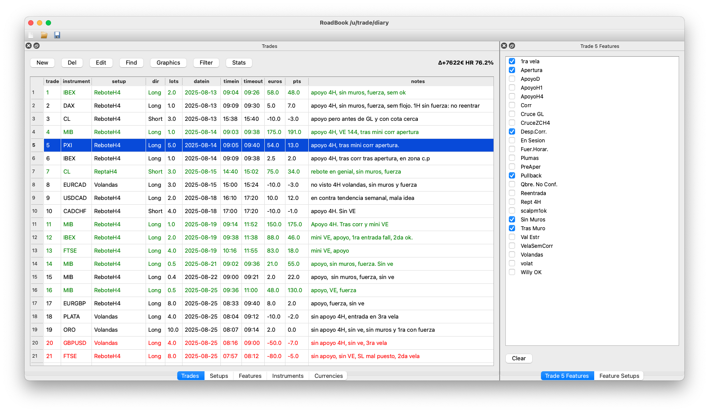
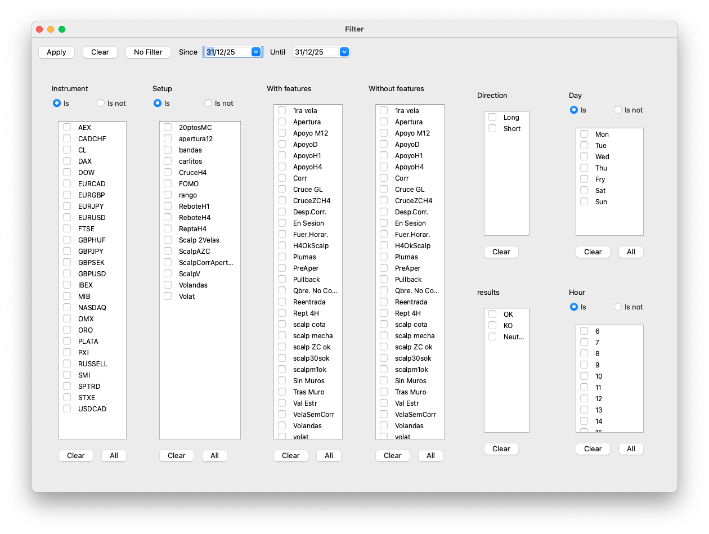
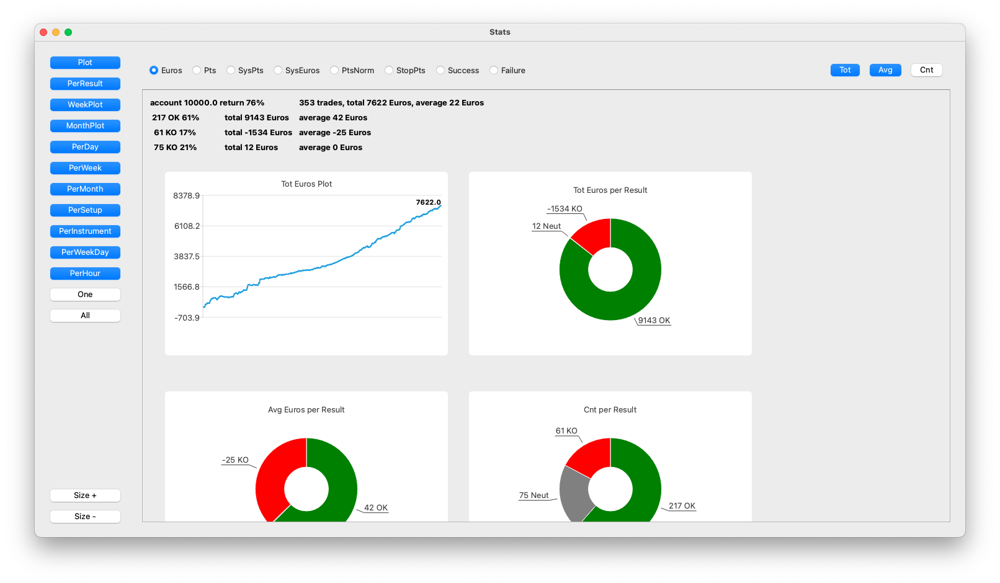
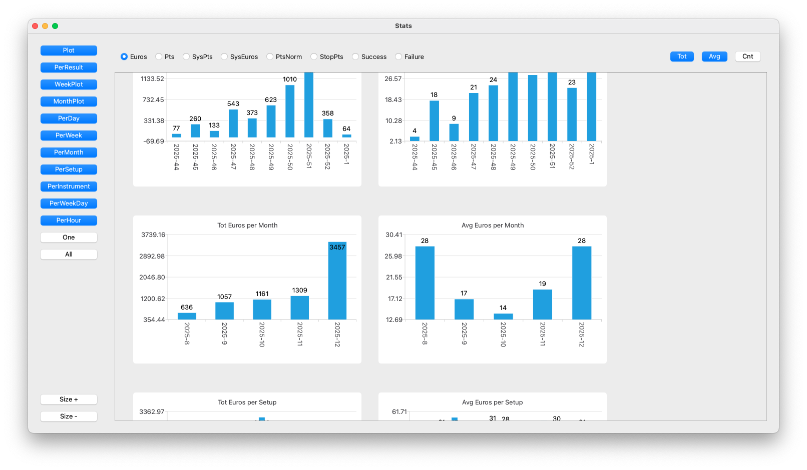
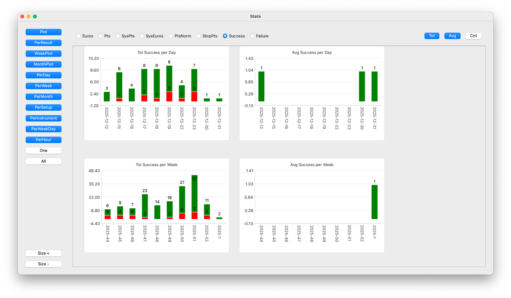
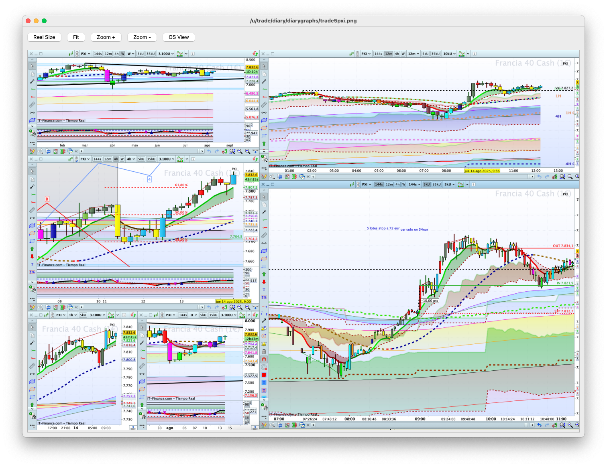

Still in alpha.
Just born for personal use.
For sure it's full of bugs.
Provided AS-IS

See near the end for a quick use guide

Uses PySide6 Qt for widgets.

To build your exec just run

pyinstaller -windowed rb.py

Or checkout [releases](https://github.com/fjballest/rb/releases) for binaries built at github.

Some screenshots:

When started, it looks for a "diary" directory at the home or documents directory.
If it can be found and contains a roadbook, that one is loaded.

To create a new roadbook, use the new roadbook icon (empty file icon) and select
the directory where to create the roadbook and the name for the roadbook.

An example trade is included in it. Just edit this trade when you add the first
trade to the roadbook, and then add new ones as desired.

The roadbook data format is a directory that contains several CSV files with
trades, account information, setups, features, etc.
If everything fails, these can be at least imported to an excel.

To add a trade, click the New button and then select at least the instrument
and the setup from the drop-down menus.
Drop a PNG file to the form to add a capture that can be browsed later for the
trade.
PNGs are kept into a directory within the roadbook directory and are named
using the trade number (generated by this program) and the instrument for
the trade.
This permits using external tools to match PNGs to trades.

Fill the information for it and click on the features it has.

Before using one that is not recorded, it is suggested to create a new instrument,
setup, or feature first, in the tabs that list them.

This is just born and probably buggy.
It is sensible to make backups somewhere else for existing data.
It is also a good idea to save (click the save file icon) after adding a
few trades.

A click on the trades or features or setups tab selects a trade, and
then edit or delete can be used to edit or delete it.

Features are things that a trade might have for a particular setup, or for
any setup. They are have-or-don't-have things.

Instruments, Features, setups, etc. can be used to filter the trades
recorded before asking for stats.
Just click on filter and select the things you want or do not want in the
filter window.
Or use a start/end date to filter by time.

Stats displays several stats (use the buttons in the stats window to
show/hide each one of thme) for the, perhaps filtered, trades.

This can be used to learn which features make some trades more likely to
fail or succeed. This was the many reason I had to write this tiny tool.

Bug reports welcome.
Remember this was written just for my personal use, but I thought
others might want to use it too or perhaps take the code and make it better.

Have fun and good trades!
